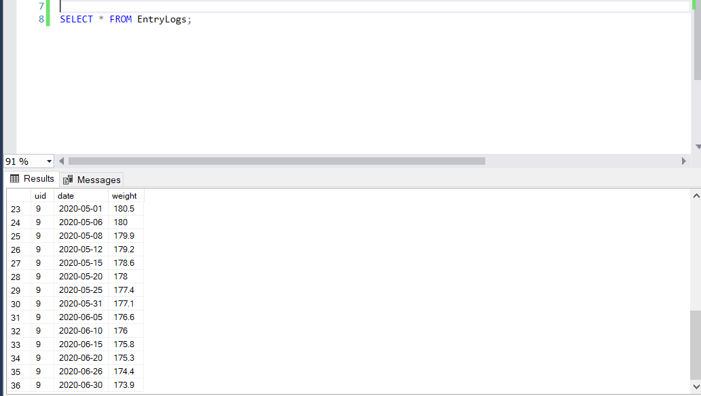

# <ins>WeightLossManager</ins>
A weight loss progress tracker, using SQL injections in Python. My primary motivation for this project was to teach myself the basics of database management while applying it to a programming language I was already quite comfortable using. Updates and additional features will be added over time.

### <ins>File Descriptions</ins>

#### GraphWLDB.py:
Creates visualization of the user's weight-loss progress over a period of time. The starting and ending dates for the graph can be given as input, if no dates are given for input, the user's entire history will be graphed.

#### RunManager.py:
Runs the main program. Reads filepath names for both new entries and new users in CSV format as command-line arguments. If no filepath command line arguments are given to Click then the UI subclass will be run, allowing the user to interact with the program via the command-line to enter their information or access program features.

#### WeightCalculations.py:
Performs supplementary calculations to find the user's BMR (Basal Metabolic Rate) and recommended calorie intake for a desired weight-loss plan. Can be called independently from WeightLossDB and WeightLossUI.

#### WeightLossDB.py:
Handles basic access to the WeightLoss database. Add new entry logs for a previous user. Reads data from a CSV file when given the filepath.

#### WeightLossUI.py:
A command-line User Interface so a user can interact with and update the database without using CSV files. A tutorial of this program is provided further below.

## <ins>User Interface Tutorial</ins>
**In order to start the UI, one must simply run the RunManager.py file with no command-line argument for Click. In order to interact with the menu, the user must simply type the number next to their desired option.**

**If this is the user's first time using the program, they can enter their information under the New User option. They must first make a new username and password. For security reasons, the password will not be displayed on the terminal as the user types.**

**The user can then use their username and password to access their account. They will then be brought to the main menu, where they can access various program features.**

**The user can enter log entries recording the date and their weight from the main menu**

**It is also possible to bypass the UI and enter a set of new log entries directly via CSV files. Simply include the filepath in the appropriate Click option on the command-line and run the startup file.**

**As we can see, the entries have been successfully inserted into the database**

**The user must first enter their login information**

**The user also has the option to graph their progress over a set course of months, compared to their projected weight using a weight loss plan (losing x pounds per week)**

**The user can also get their predicted weight on a given day using a weightloss schedule (lbs. lost per week)**

**The user can also calculate how many calories they should consume to remain at their current weight, as well as how many calories they should consume in order to lose a certain number of pounds per week**

**If the user gets confused, they can select the Help option for a brief description of the application's features**

